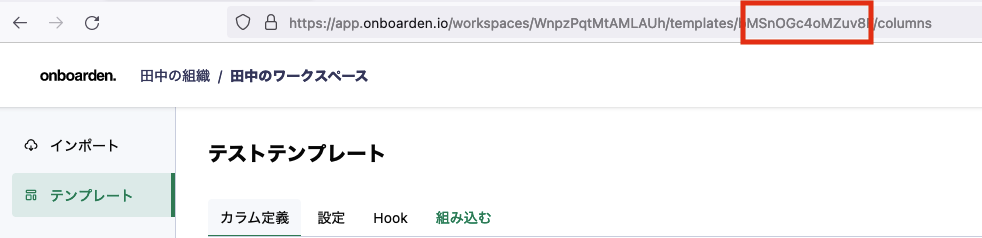
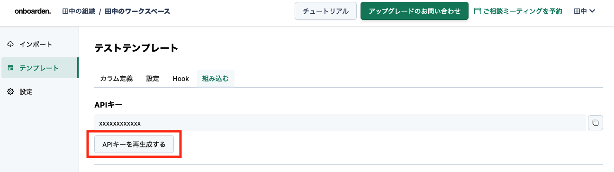
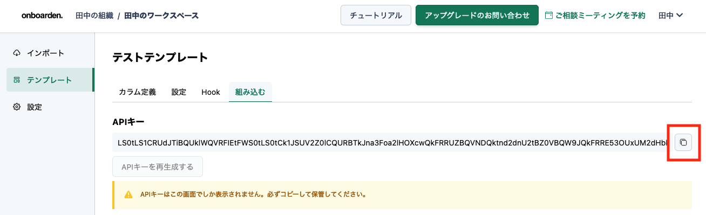
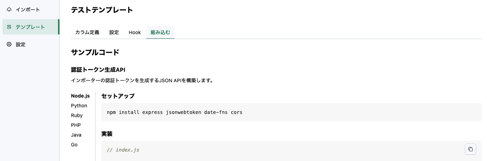
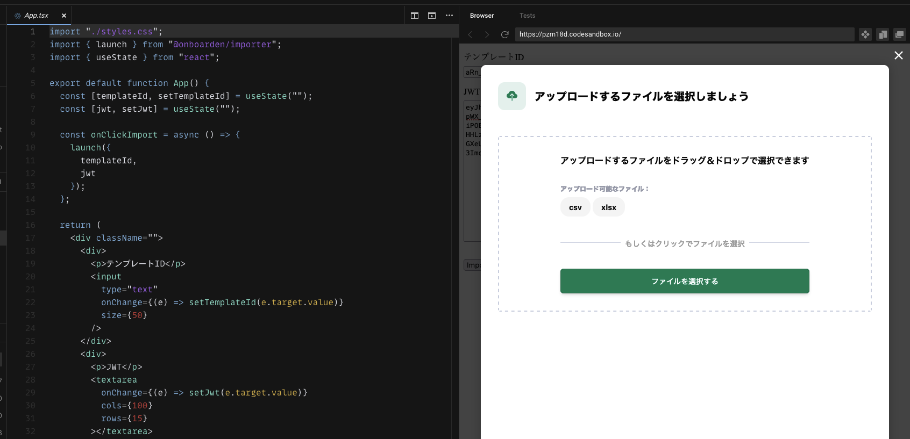

import Tabs from "@theme/Tabs";
import TabItem from "@theme/TabItem";

# インポーターを設置する

アプリケーションに onboarden のインポーターを組み込みます。

## テンプレート ID を取得

テンプレートをまだ作成していない場合は、[テンプレートを作成する](/getting-started/make-a-template) を参考にテンプレートを作成してください。

作成したテンプレートのページに移動して、アドレスバーの URL からテンプレート ID を取得してください。

URL の `templates/` の後ろのランダム文字列部分がテンプレート ID です。



## 認証トークンを生成する

インポーターを起動するには JSON Web Token (以下、JWT) が必要です。
Payload には下記のデータが必要です。

| Header | Description                                                                                                                                                                         | Example             |
| ------ | ----------------------------------------------------------------------------------------------------------------------------------------------------------------------------------- | ------------------- |
| `sub`  | あなたの App のユーザーを一意に識別する ID。設定すると、 ユーザーがインポートを中断した場合でも再アクセス時に途中から再開でき、またユーザーごとに列のマッピング情報が記憶されます。 | ユーザー ID         |
| `exp`  | トークンの有効期限。任意の日時を設定できますが、ユーザーによるインポート作業が完了するまでの間に有効期限が訪れないように設定してください。                                          | 現在時刻の 1 時間後 |

:::caution
`sub`に設定する値について

本番稼働の際は、別々のユーザーに共通の値を設定しないでください。インポート中のデータが別のユーザーによって閲覧・上書きされる可能性があります。
:::

また、署名アルゴリズムは RS256 を使用する必要があります。

### 鍵を用意する

署名に用いる鍵を用意します。

作成したテンプレートページの「組み込む」タブに移動し、「API キーを再生成する」ボタンを押してください。



ボタンを押すと鍵が生成されます。

右側のボタンでコピーできます。



生成した鍵は大切に保管してください。

:::danger

鍵が漏洩した場合、鍵を手にした悪意のある人間がインポーターを起動できてしまいます。

:::

### JWT を生成する

必要な依存をインストールします。

```bash
mkdir jwt && cd jwt
npm init --y
npm install jsonwebtoken date-fns
```

スクリプトを作成します。

`API_KEY` の部分は、上記で生成した鍵に置き換えてください。

```js title=main.js
const jwt = require("jsonwebtoken");
const addMinutes = require("date-fns/addMinutes");

// highlight-next-line
const API_KEY = "YOUR_API_KEY"; // change this
const token = jwt.sign(
  {
    sub: "user-id-of-your-app",
    // 1時間後に期限切れにする
    exp: addMinutes(new Date(), 60).getTime() / 1000,
  },
  Buffer.from(API_KEY, "base64").toString(),
  { algorithm: "RS256" }
);

console.log(token);
```

下記のコマンドで JWT を生成します。

```bash
node main.js
# JWTが出力されます
```

出力された JWT はインポーターを起動する際に使用します。

:::info

このガイドではわかりやすさのために手動で JWT を生成していますが、実際にご自身のプロダクトにインポーターを組み込む際はリクエスト毎にサーバーサイドで JWT を生成する必要があります。

作成したテンプレート画面「組み込む」タブにて各言語のサンプルコードが確認できます。



:::

## インポーターを設置する

テンプレート ID と JWT の準備ができたら、あとはインポーターを起動するだけです。

下記のいずれかの方法でインポーターを起動してみましょう。

- CodeSandbox を使う
- スクラッチでインポーターを設置する

### CodeSandbox でテストする

[CodeSandbox の Example](https://codesandbox.io/s/onboarden-importer-sample-pzm18d) を用いてインポーターの起動をテストができます。

テンプレート ID と JWT を入力して、「import」ボタンを押すとインポーターが起動できます。



### スクラッチでインポーターを設置する

下記の HTML ファイルを作成してください。

テンプレート ID と、JWT は自身のものに置き換えてください。

```html title=index.html
<!DOCTYPE html>
<html lang="en">
  <head>
    <title>Onboarden Example</title>
  </head>
  <body>
    <button id="import">Import</button>

    <script src="https://cdn.jsdelivr.net/npm/@onboarden/importer/dist/browser/onboarden-importer.min.js"></script>
    <script>
      document.getElementById("import").onclick = async () => {
        OnboardenImporter.launch({
          templateId: "テンプレートID",
          jwt: "JWT",
        });
      };
    </script>
  </body>
</html>
```

作成した HTML ファイルをブラウザで開いてください。

「Import」 ボタンを押下すると、インポーターが起動します。


これでインポーターの設置ができました。
